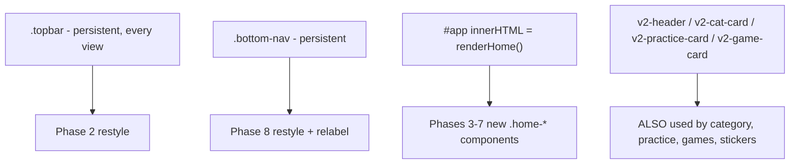

# Talki Home Redesign — Phased Implementation Plan

> This is the **working plan** actually being executed for this redesign — adapted from the original source plan below to match Talki's real architecture (a single-file vanilla-JS PWA, not a React/Vite app). Progress, findings and results are recorded in [talki-home-redesign-audit.md](talki-home-redesign-audit.md).
>
> Source plan (generic, written before the codebase audit): [talki-home-redesign-cursor-plan.md](talki-home-redesign-cursor-plan.md)
> Approved mockup: [design/talki-home-approved.png](design/talki-home-approved.png)

Run **one phase per Cursor session**. Each phase below ends with a paste-ready run prompt.

---

# 0. Governing Rules

## 0.1 Plan adaptation (read this first)

The source plan was written for a React/Vite app. Talki is a **single-file vanilla-JS PWA** — HTML, CSS and JS all live in [index.html](../index.html) (~2,986 lines). Every phase is translated as follows:

- `src/features/home/HomePage.tsx` → `renderHome()` at [index.html:1376](../index.html) plus small sibling render helpers in the same file
- CSS modules → one new `/* ---- Home V3 ---- */` block appended after the existing V2 block ([index.html:605-722](../index.html))
- `npm run lint / typecheck / build` → **do not exist**. Substitute `node --check` on the external JS files, `node --test tests/audio-logic.test.js`, and `python3 tests/test_suite.py`.
- `docs/design/talki-home-approved.png` → does not exist. The mockup is [talki-home-redesign-cursor-plan.png](talki-home-redesign-cursor-plan.png), copied to the canonical path in Phase 0.

Confirmed decisions: rewrite in place; restyle shared chrome globally; relabel bottom nav (מדבקות→הישגים, הורה→הגדרות) keeping the same destinations.

## 0.2 Two sources of truth

The mockup governs visual hierarchy, spacing, color, proportion and artwork placement. [index.html](../index.html) governs state, navigation, progress, audio, games and settings. Never replace working behavior with mocked values to make the screenshot look right.

## 0.3 Three hard structural constraints



1. **Do not edit `.v2-header`, `.v2-cat-card`, `.v2-practice-card` or `.v2-game-card` in place.** They are shared with `renderCategory`, `renderPractice`, `renderGamesMenu` and `renderStickers`. Add new `.home-hero`, `.home-cat-card`, `.home-practice-card`, `.home-game-card` classes instead.
2. **`syncBarHeight()`** ([index.html:2792](../index.html)) measures `.topbar` into `--barh`, which `.cat-header` consumes as its sticky offset. Header height grows ~70px → ~84px; re-verify category and games sub-headers.
3. **Fix the listener leak before moving `data-nav` into the topbar.** `on()` ([index.html:2220](../index.html)) is `document.querySelectorAll` and `bind()` runs on every `render()`, so persistent `[data-nav]` chrome gains one extra click listener per render — the bottom nav already does this today.

## 0.4 Real data that must be wired, never hardcoded

- Points = `learned.size` ([index.html:962](../index.html)); totals via `totalWords()` and `catLearned(cat)`
- Continue target = `currentCategory()` ([index.html:1359](../index.html)) — derived; there is no persisted "last category"
- Categories = `allCats()` / `CATEGORIES` ([index.html:804](../index.html)) — **11 entries** (10 built-in + `mine`)
- Category icons = `catIcon(id)` → `assets/v2/categories/talki-cat-icon-*.png`, `assets/v2/brand/talki-star-mark.png` for `mine`
- Practice = `PRACTICE_LIST` ([index.html:1367](../index.html)); Home shows `.slice(0,3)` = focus / receptive / cloze
- Games = `data-game` → `launch()` → `startGame()` ([index.html:1635](../index.html))
- Header controls = `#musicBtn` → `setMusic()`, `#speedBtn` → `settings.rate` cycle, `#parentBtn` → 900 ms long-press ([index.html:2810-2830](../index.html))

## 0.5 Mockup-vs-data conflicts, resolved in favour of the app

- Mockup draws 9 categories; the app has 11 (`פעולות`, `מספרים` omitted from the mockup) → render all 11 from `allCats()`
- Mockup's `משפחה` card carries a `123` icon and `0/16` → keep each category's own icon and real counts
- Mockup game title `איזה זה...?` → keep the app's `איפה ה...?` for `quiz`
- Mockup hero heading `היי כאן דברי` is garbled Hebrew → keep the app's `היי! בואו נדבר`. The mockup subtitle `לומדים מילים, מתרגלים ודוברים בביטחון` already matches the app exactly.
- Mockup brand tagline `לומדים, מדברים ובטוחים` vs the app's `לוחצים, שומעים ולומדים לדבר` → **open copy decision, confirm in Phase 2**

## 0.6 Design tokens

Add the source plan's `--talki-*` palette (its Section 5.1), type scale, spacing, radii and three shadow levels **additively** to the existing `:root` at [index.html:28](../index.html). Keep `--cream`, `--grape`, `--v2-*` so the ~20 other screens keep rendering. Home components reference `--talki-*`; legacy screens keep the old names.

## 0.7 Validation loop (mandatory every visual phase)

```text
Inspect → Implement → Run dev server → Screenshot → Compare to mockup → Fix → Screenshot again → Click the controls → Duplicate-definition check → Proceed
```

Compilation is never sufficient.

## 0.8 Duplicate-definition check (risk: no build step, no bundler, no lint)

[index.html](../index.html) is a single 2,986-line file hand-edited across 15 phases with no bundler or linter to catch accidental duplicates. Run this after **every** phase, before moving on:

```bash
grep -oE 'function [A-Za-z0-9_]+\(' index.html | sort | uniq -d
grep -oE '^\s*\.[A-Za-z0-9_-]+(\s*,\s*\.[A-Za-z0-9_-]+)*\s*\{' index.html | sed 's/[{ ]*$//' | sort | uniq -d
grep -c 'id="ringFill"\|id="progressCount"\|id="musicBtn"\|id="speedBtn"\|id="parentBtn"' index.html
```

Expect zero output from the first two (no duplicate function names, no duplicate top-level CSS selector declarations), and expect the third to report the same count as before the phase started — a changed count means an id was accidentally duplicated or an old copy was left behind instead of replaced. This is a cheap substitute for the linting the repo doesn't have; it will not catch everything, but it catches the specific failure mode of copy-paste edits inside one large file.

---

# PHASE 0 — Audit and Harness ✅ done

## Goal

Establish the reference image, screenshot harness and baseline before touching any UI.

## Implement

- Copy [talki-home-redesign-cursor-plan.png](talki-home-redesign-cursor-plan.png) to `docs/design/talki-home-approved.png`
- Create `artifacts/talki-home-redesign/` and add `artifacts/` to `.gitignore`
- Fix [tools/screenshot.js](../tools/screenshot.js): it hardcodes `http://localhost:5173` but `npm run dev` ([tools/dev-server.js](../tools/dev-server.js)) serves port **8000**. Read `process.env.BASE_URL` with a `http://localhost:8000` default.
- Write `docs/talki-home-redesign-audit.md` documenting the vanilla-JS adaptation, real state sources, reusable assets, and the `bind()` listener-leak finding

## Validation

```text
artifacts/talki-home-redesign/00-before-390.png
```

## Do not

Redesign UI, change handlers, or move logic in this phase.

## Done when

Reference image is in place, the screenshot script runs against port 8000, the baseline exists, and the audit doc records the boundaries.

## CURSOR RUN 1 — PHASE 0

```text
Execute ONLY Phase 0 of the Talki Home Redesign plan.

Talki is a single-file vanilla-JS PWA: all HTML, CSS and JS live in index.html.
Do not change any UI in this run.

1. Copy docs/talki-home-redesign-cursor-plan.png to docs/design/talki-home-approved.png
2. Create artifacts/talki-home-redesign/ and add artifacts/ to .gitignore
3. Fix tools/screenshot.js: replace the hardcoded http://localhost:5173 with
   process.env.BASE_URL defaulting to http://localhost:8000
4. Start the dev server (npm run dev, port 8000) and capture
   artifacts/talki-home-redesign/00-before-390.png at 390x844
5. Write docs/talki-home-redesign-audit.md covering: the Home render path
   (renderHome at index.html:1376), real state sources (learned, currentCategory,
   allCats, PRACTICE_LIST), the shared .v2-* classes used by other screens,
   the --barh coupling in syncBarHeight(), the bind() duplicate-listener leak,
   the available assets under assets/v2/, and which assets are missing.

Stop after Phase 0 and report files discovered, state sources, reusable assets,
technical risks, and recommended implementation boundaries.
```

---

# PHASE 0.5 — Test Environment and Regression Baseline ✅ done

## Goal

Phase 0's audit surfaced a gap the rest of the plan quietly assumes away: `tests/test_suite.py` (the only functional E2E coverage Talki has) cannot currently run, because the Python `playwright` package is not installed. Phase 12 (Automated Quality) expects to run this suite *after* the whole redesign and diff the result — but without a true "before" baseline, any failure found there is ambiguous: pre-existing, or caused by the redesign? This phase closes that gap before any Home code changes begin.

## Implement

- Install the Python Playwright package and its browser binary (a local `.venv` was used since system Python is externally managed): `python3 -m venv .venv && .venv/bin/pip install playwright && .venv/bin/python -m playwright install chromium`
- Run the existing suites against the **untouched** app and record results verbatim:
  - `node --test tests/audio-logic.test.js` — **18/18 pass**
  - `BASE_URL=http://localhost:8000 python3 tests/test_suite.py` — **26/26 checks pass, ALL CHECKS PASSED**
- Zero pre-existing failures were found — see `docs/talki-home-redesign-audit.md` → `## Pre-redesign test baseline` for full verbatim output

## Do not

Change any application code, CSS, or markup. This phase only installs tooling and records results.

## Validation

No screenshot required. Deliverable was a results log appended to `docs/talki-home-redesign-audit.md` under `## Pre-redesign test baseline`.

## Done when

Both test suites can execute end-to-end without environment errors, and their real pass/fail baseline is written down for later phases to diff against. *(Done — clean bar, zero pre-existing failures.)*

## CURSOR RUN 0.5 — PHASE 0.5

```text
Execute ONLY Phase 0.5 of the Talki Home Redesign plan.

Do not change any application code, CSS or markup in this run.

1. Install Python Playwright: pip install playwright && python3 -m playwright install chromium
   (use a local venv if the system Python is externally managed)
2. Run node --test tests/audio-logic.test.js and record the exact pass/fail counts
3. Start the dev server (npm run dev, port 8000) if not already running, then run
   BASE_URL=http://localhost:8000 python3 tests/test_suite.py and record the exact
   pass/fail result for every test in the suite, including full output for any failure
4. Append a "## Pre-redesign test baseline" section to
   docs/talki-home-redesign-audit.md listing both commands and their verbatim
   results. If any test already fails today, record it as a known pre-existing
   failure - do not attempt to fix it in this run.

Stop after Phase 0.5 and report whether both suites now run, and the full
pre-redesign pass/fail baseline.
```

---

# PHASE 1 — Foundation and Tokens

## Goal

Create the shared visual foundation and fix the event-binding leak, without redesigning any section yet.

## Implement

- Add `--talki-*` tokens additively to `:root` ([index.html:28](../index.html)); do not remove existing variables
- Append a `/* ---- Home V3 ---- */` CSS block after the V2 block ([index.html:722](../index.html))
- Replace the `body[data-view="home"]` rule at [index.html:150](../index.html): the hero landscape becomes a discrete card, so the page background becomes flat cream

```css
background: radial-gradient(circle at 50% 0%,
  rgba(255,255,255,.92) 0%, rgba(255,249,239,.96) 34%, #FFF9EF 100%);
```

- Scope `bind()`'s queries to `#app`, and attach **one** delegated `click` listener on `document` at startup for persistent `[data-nav]` chrome

## Shared primitives

```css
--home-padding-inline: 16px;   /* 18px at 430px, 24px on tablet */
--home-section-gap: 28px;
--home-grid-gap: 12px;         /* 14px at 430px */

/* card */
background:#FFFFFF; border:1px solid #F1E7D7;
border-radius:22px; box-shadow:0 6px 16px rgba(73,46,25,.09);

/* section heading */
font-size:22px; font-weight:800; line-height:1.2;
color:#4E2A72; margin-bottom:12px;
```

Keep `main`'s existing `max-width` behavior but cap Home content at `760px` centered.

## Validation

```text
artifacts/talki-home-redesign/01-foundation-390.png
```

## Done when

Tokens are centralized, the Home background is flat cream, `bind()` no longer accumulates listeners on persistent chrome, RTL is unchanged, and every other screen still renders.

## CURSOR RUN 2 — PHASE 1

```text
Execute ONLY Phase 1 of the Talki Home Redesign plan.

In index.html:
1. Add the --talki-* palette, type scale, spacing, radii and the three shadow
   levels to the existing :root at line ~28. ADD ONLY - do not remove --cream,
   --grape, --v2-* or any existing variable; ~20 other screens depend on them.
2. Append a new "/* ---- Home V3 ---- */" CSS block after the V2 block (~line 722).
3. Replace the body[data-view="home"] rule (~line 150) so Home no longer paints
   talki-bg-home-hero.png behind the page; use the flat cream radial gradient.
   Leave every other body[data-view=...] rule untouched.
4. Fix the duplicate-listener leak: on() at line 2220 uses
   document.querySelectorAll and bind() runs on every render(), so the persistent
   .bottom-nav [data-nav] buttons gain a listener per render. Scope bind()'s
   selectors to #app, and add ONE delegated document click listener at startup
   for persistent chrome.
5. Add a Home content container capped at max-width 760px, centered.

Do not redesign the header, hero, categories, practice or games yet.
Do not change business logic.

Capture artifacts/talki-home-redesign/01-foundation-390.png and click through
Home, a category, games, practice, stickers and the parent screen to confirm
nothing regressed. Report files changed and any intentional token deviations.
```

---

# PHASE 2 — Top Header

## Goal

Restyle the persistent `.topbar` ([index.html:727-748](../index.html)) to the mockup while preserving every real control.

## Visual anatomy (RTL)

```text
[ gift ] [ music ] [ speech-rate ]     [ 0 נקודות ⭐ ]     Talki ⭐
                                                          Hebrew tagline
```

## Baseline specs

```css
.topbar        { min-height:72px; padding-block:8px; gap:10px; }  /* max ~84px */
.utility-btn   { width:44px; height:44px; border-radius:14px;
                 background:#FFF; border:1px solid #F1E7D7;
                 box-shadow:var(--shadow-sm); }                   /* icon 24px, tune 42-48 */
.points-badge  { min-width:72px; height:46px; padding-inline:12px;
                 border-radius:18px; background:#FFF;
                 border:1px solid #F1E7D7; box-shadow:var(--shadow-sm); }
.brand h1      { font-size:28px; font-weight:800; line-height:1; color:#6D3BA6; }
.brand span    { font-size:11px; font-weight:500; color:#746887; margin-top:4px; }
```

Points number `17px/800`; label `נקודות` `10px` `#6D3BA6`; star `18-20px`; brand star mark `40-46px` from `assets/v2/brand/talki-star-mark.png`.

## Functional requirements

- Move the gift/rewards control out of the hero ([index.html:1402](../index.html)) into the topbar, keeping `data-nav="stickers"`. This only works safely **after** Phase 1's binding fix.
- `#musicBtn` keeps `setMusic()` and `syncMusicIcon()`; `#speedBtn` keeps the `settings.rate` cycle plus its demo `speakTTS('שלום')`
- `#parentBtn` moves out of the topbar (the mockup has three utility buttons); the parent screen is reachable from the `הגדרות` tab in Phase 8. **Keep the 900 ms long-press affordance somewhere** — attach it to the brand mark so `pBtn` logic at [index.html:2817-2830](../index.html) still has a host element.
- Show real `learned.size` as the points value. The mockup badge has **no ring**, so remove `#ringFill` from the topbar — and update `updateHeader()` ([index.html:1304](../index.html)) in the same edit, because it currently dereferences `#ringFill` unconditionally and will throw.
- Confirm the tagline copy decision from Section 0.5 before writing it.

## Missing assets

Log in `docs/talki-home-missing-assets.md` (High): `talki-ui-icon-music.png`, `talki-ui-icon-speech-rate.png`. Gift, star and settings icons already exist in `assets/v2/icons/`.

## Validation

```text
artifacts/talki-home-redesign/02-header-390.png
```

Also check `.cat-header` sticky offsets on the category and games screens after the height change, and confirm no overflow at 375px.

## Done when

All three utility controls work, points are dynamic, no emoji remain in the header, `updateHeader()` is safe, `--barh` is correct, and the long-press parent entry still functions.

## CURSOR RUN 3 — PHASE 2

```text
Execute ONLY Phase 2 (Top Header) of the Talki Home Redesign plan.

Restyle the persistent .topbar in index.html (lines ~727-748) to match
docs/design/talki-home-approved.png. This bar appears on EVERY screen.

Layout (RTL): three white utility buttons at the inline-start (gift/rewards,
music, speech-rate), a white points badge in the centre, and the Talki wordmark
+ tagline + star mark at the inline-end.

Use the plan's exact sizes: utility 44x44 r14 with 24px icons, points badge
min-width 72 / height 46 / r18, wordmark 28px/800 #6D3BA6, tagline 11px/500
#746887, star mark 40-46px.

Requirements:
- Move the gift control from the hero (line ~1402) into the topbar, keeping
  data-nav="stickers"
- Keep #musicBtn -> setMusic() and #speedBtn -> settings.rate cycle + demo TTS
- Remove #parentBtn from the topbar but KEEP the 900ms long-press parent entry
  by rehosting it on the brand mark, so the pBtn code at lines 2817-2830 still
  has an element
- Show real learned.size as the points value with the label נקודות
- The mockup badge has no progress ring: remove #ringFill from the topbar AND
  update updateHeader() (line ~1304) in the same edit, or it will throw
- Replace the 🎵 / 🐇 / 👤 emoji with real icons; log
  talki-ui-icon-music.png and talki-ui-icon-speech-rate.png as High priority in
  docs/talki-home-missing-assets.md with full generation specs
- Every control must be a real button with an aria-label and a focus-visible state

Before writing the tagline, ask me whether to keep the app's
"לוחצים, שומעים ולומדים לדבר" or adopt the mockup's "לומדים, מדברים ובטוחים".

Validate at 375, 390 and 430px. The bar feeds --barh via syncBarHeight(), which
.cat-header uses as a sticky offset - verify the category and games screens.

Save artifacts/talki-home-redesign/02-header-390.png and do at least one
compare-and-fix iteration before stopping.
```

---

# PHASE 3 — Welcome Hero

## Goal

Replace the full-bleed `.v2-header` banner on Home with a rounded illustrated hero card, without touching the shared `.v2-header` class.

## Specs

```css
.home-hero { width:100%; min-height:190px;   /* range 185-215 */
             border-radius:28px; overflow:hidden;
             position:relative; margin-top:6px; }
.home-hero-bg { position:absolute; inset:0; width:100%; height:100%;
                object-fit:cover; }
.home-hero-content { position:relative; z-index:2; width:60%;   /* 58-62% */
                     padding:24px 18px 18px 14px; }
```

Heading `30px/800`, line-height `1.08`, `#44206F`. Subtitle `14px/500`, line-height `1.35`, `#5F4776`, `margin-top:8px`. Mascot `110-130px`, inline-start, anchored to the lower half.

CTA:

```css
height:52px; min-width:220px; padding-inline:18px; border-radius:999px;
background:linear-gradient(135deg,#7C4CD6,#6D3BA6);
box-shadow:0 8px 18px rgba(109,59,166,.25); margin-top:14px;
```

CTA text `המשך ללמידה` `17px/800` white; white `38px` circle with an inline-SVG arrow pointing **inline-end** (left in RTL), `#6D3BA6`.

## Content and behavior

- Heading: keep the app's `היי! בואו נדבר` (see Section 0.5)
- Subtitle: `לומדים מילים, מתרגלים ודוברים בביטחון`
- Background: `assets/v2/backgrounds/talki-bg-home-hero.png`; mascot: `mascot('wave', 120)` → `assets/v2/mascot/talki-star-waving.png`
- CTA keeps `data-cat="${cur.id}"` from `currentCategory()`. Do not invent a route.
- Drop `.v2h-scrim` on Home — the mockup has dark text on the bright landscape, not white-on-scrim

## Responsive

375px: keep hero ≥180px, shrink mascot if it collides, CTA may narrow. 430px: more breathing room, do not scale children proportionally. 768px: cap height at 280-300px.

## Validation

```text
artifacts/talki-home-redesign/03-hero-390.png
```

Compare hero height, mascot scale and offset, title position, CTA size, background crop, radius, and header-to-hero gap (8-12px).

## Done when

Hebrew is DOM text, the CTA is a real button resuming the real category, no text is baked into artwork, and `.v2-header` still renders correctly on category, practice, games and stickers.

## CURSOR RUN 4 — PHASE 3

```text
Execute ONLY Phase 3 (Welcome Hero) of the Talki Home Redesign plan.

In index.html, replace the .v2-header block inside renderHome() (lines
~1395-1410) with a new rounded .home-hero card.

CRITICAL: do NOT modify the shared .v2-header CSS class - renderCategory,
renderPractice, renderGamesMenu and renderStickers all use it. Create new
.home-hero / .home-hero-bg / .home-hero-content classes instead.

Compose it from existing artwork:
- background: assets/v2/backgrounds/talki-bg-home-hero.png, object-fit cover
- mascot: mascot('wave', 120) at the inline-start, anchored to the lower half
- no dark scrim - the mockup uses dark purple text over the bright landscape

Real DOM text, RTL, at the inline-end 60% of the card:
- heading "היי! בואו נדבר" at 30px/800, line-height 1.08, #44206F
  (keep the app's wording; the mockup's "היי כאן דברי" is garbled Hebrew)
- subtitle "לומדים מילים, מתרגלים ודוברים בביטחון" at 14px/500, #5F4776

CTA: a real button, height 52, min-width 220, pill radius, gradient
linear-gradient(135deg,#7C4CD6,#6D3BA6), shadow 0 8px 18px rgba(109,59,166,.25),
label "המשך ללמידה" at 17px/800 white, plus a 38px white circle containing an
inline-SVG arrow pointing to the inline-end, coloured #6D3BA6.

The CTA must keep data-cat="${cur.id}" from currentCategory() - do not invent a
route, and handle cur being null.

Hero min-height 190px (range 185-215), border-radius 28px, margin-top 6px.
Validate at 375, 390, 430 and 768px.

Save artifacts/talki-home-redesign/03-hero-390.png, compare against
docs/design/talki-home-approved.png, refine, then confirm the category,
practice, games and stickers headers still look right.
```

---

# PHASE 4 — Continue Where We Stopped

## Goal

Rebuild the continuation card ([index.html:1412-1417](../index.html)) with a real SVG progress ring.

## Specs

```css
.home-continue { margin-top:16px; min-height:104px; padding:16px 18px;
                 border-radius:24px; background:#FFF;
                 border:1px solid #F1E7D7; box-shadow:var(--shadow-card); }
```

RTL order, inline-start to inline-end:

```text
category icon tile  →  text block  →  progress ring  →  chevron
```

- Icon tile `58×58` r`18`, artwork `42×42` `object-fit:contain`, background from `catGrad(cur.id)`
- Eyebrow `מתרגלים היום` `12px/700` `#746887`
- Title = `display(cur.title)` `22px/800` `#241735`, `margin-top:2px`
- Support line `ממשיכים מאיפה שעצרנו` `12px/500` `#746887`, `margin-top:4px`
- Ring `64×64`, track `#EEEAF3`, active `#B898F1` or `#7C4CD6` (pick by comparison), stroke `7-8px`, centre label `16px/800` `#542780`
- Chevron `32×32`, inline SVG, pointing inline-end

The ring must be **SVG or `conic-gradient`, never an image**. Reuse the `stroke-dasharray` / `stroke-dashoffset` maths already in `updateHeader()`.

## Real data

`currentCategory()`, `catLearned(cur)`, `cur.items.length`, `catIcon(cur.id)`, `data-cat`. No hardcoded `חיות` or `0%`.

## States to test

`0%`, partial, `100%`, no history (`cur === null` → keep the current behavior of omitting the card, or show a start-learning state routing to the first category), and a long Hebrew title such as `הַמִּלִּים שֶׁלִּי`.

## Validation

```text
artifacts/talki-home-redesign/04-continue-390.png
```

## Done when

Data is dynamic, resume navigates to the right category, the percentage matches the category screen, the icon is shared with the category system, and the card reads as secondary to the hero.

## CURSOR RUN 5 — PHASE 4

```text
Execute ONLY Phase 4 (Continue Where We Stopped) of the Talki Home Redesign plan.

In index.html, rebuild the .v2-continue button inside renderHome()
(lines ~1412-1417) as a new .home-continue card. Add new CSS; do not repurpose
.v2-continue if any other screen uses it.

Card: margin-top 16, min-height 104, padding 16px 18px, border-radius 24,
white, 1px #F1E7D7 border, --shadow-card.

RTL order from inline-start to inline-end: category icon tile, text block,
progress ring, chevron.

- icon tile 58x58 r18 with catGrad(cur.id) background and a 42x42
  catIcon(cur.id) image, object-fit contain
- eyebrow "מתרגלים היום" 12px/700 #746887
- title display(cur.title) at 22px/800 #241735
- support line "ממשיכים מאיפה שעצרנו" 12px/500 #746887
- progress ring 64x64, track #EEEAF3, active #B898F1 or #7C4CD6 (choose by
  comparing to the mockup), stroke 7-8px, centre percentage 16px/800 #542780
- chevron 32x32 inline SVG pointing to the inline-end

Implement the ring with SVG stroke-dasharray/stroke-dashoffset (reuse the maths
in updateHeader) or a conic-gradient. NEVER an image.

All values must come from currentCategory(), catLearned(cur) and
cur.items.length. Keep data-cat routing. No hardcoded חיות or 0%.

Test and report: 0%, partial, 100%, cur === null, and a long Hebrew title.

Save artifacts/talki-home-redesign/04-continue-390.png, compare to the mockup
and fix discrepancies before stopping.
```

---

# PHASE 5 — Categories

## Goal

Rebuild the two-column categories grid ([index.html:1381-1392](../index.html), [index.html:1418-1419](../index.html)) from `allCats()`.

## Section heading

`קטגוריות` at `22px/800` `#4E2A72`, with a purple four-square grid glyph as **inline SVG** at the inline-end. Replace the existing `.section-label` emoji `🗂️` and its `::after` rule for Home. Heading-to-grid gap `12px`; section top gap `28px`.

## Grid and card

```css
.home-cat-grid { display:grid; grid-template-columns:repeat(2,minmax(0,1fr));
                 gap:12px; }                       /* 14px at 430px */
.home-cat-card { min-height:96px; padding:12px 14px 10px;
                 border-radius:20px; background:#FFF;
                 border:1px solid #F1E7D7; box-shadow:var(--shadow-card); }
```

Card interior per the mockup: icon tile at the **inline-start**, vertically centred; a content column beside it holding title, progress meta, then the bar.

- Icon tile `50×50` r`16`, image `36×36`
- Title `17px/800`, line-height `1.2`, `#241735`; use `clamp()` down to 15-16px so `צְבָעִים וְצוּרוֹת` does not wrap badly
- Meta `${done}/${tot}` `11px/600` `#746887` with a `14px` gold star
- Bar track `height:5px; border-radius:999px; background:#F3EEE6`; fill uses the category accent

## Accent mapping

```text
animals   mint    #8FD3C1      food      pink    #F46B91
home      blue    #69B7EF      colors    purple  #9366E5
body      pink    #F46B91      family    peach   #FFB977
numbers   gold    #FFD75A      actions   green   #79CFAE
emotions  purple  #9366E5      outside   blue    #69B7EF
mine      purple  #7C4CD6
```

Add this as a `CAT_ACCENT` map next to the existing `CAT_GRAD` ([index.html:1349](../index.html)) rather than duplicating category metadata.

## My Words

```css
grid-column: 1 / -1; min-height: 86px;
```

## Requirements

Render **all 11** categories from `allCats()`, not the mockup's 9. Keep `data-cat` on the whole card as a single ≥44×44 touch target with no nested interactive controls.

## Validation

```text
artifacts/talki-home-redesign/05-categories-390.png
```

Compare card height, grid gap, icon scale, title alignment, progress labels and bars, My Words width, and cumulative page density.

## Done when

All 11 categories render with real totals and progress, every card navigates, no emoji remain, no overflow at 375px, and the grid matches the reference.

## CURSOR RUN 6 — PHASE 5

```text
Execute ONLY Phase 5 (Categories) of the Talki Home Redesign plan.

In index.html, rebuild the category grid inside renderHome() (the cards template
at lines ~1381-1392 and the .section-label + .v2-cat-grid at ~1418-1419) as new
.home-cat-grid / .home-cat-card classes.

CRITICAL: do NOT modify .v2-cat-card - renderCategory and other screens use it.

Section heading "קטגוריות" at 22px/800 #4E2A72 with a purple four-square grid
glyph as inline SVG at the inline-end. No emoji. Section top gap 28px, heading
bottom gap 12px.

Grid: 2 columns, gap 12px (14px at 430px+). Card: min-height 96, padding
12px 14px 10px, radius 20, white, 1px #F1E7D7, --shadow-card.

Card interior (RTL, matching the mockup): icon tile at the inline-start,
vertically centred; content column beside it with title, then progress meta,
then the bar.
- icon tile 50x50 r16 with a 36x36 catIcon(cat.id) image
- title display(cat.title) 17px/800 #241735, clamp down to 15-16px so
  צְבָעִים וְצוּרוֹת does not wrap badly
- meta "${done}/${tot}" at 11px/600 #746887 with a 14px gold star
- bar track height 5, radius 999, background #F3EEE6; fill = category accent

Add a CAT_ACCENT map next to the existing CAT_GRAD (line ~1349):
animals #8FD3C1, food #F46B91, home #69B7EF, colors #9366E5, body #F46B91,
family #FFB977, numbers #FFD75A, actions #79CFAE, emotions #9366E5,
outside #69B7EF, mine #7C4CD6.
Do not duplicate any other category metadata - keep using allCats().

Render ALL 11 categories from allCats(). The mockup only draws 9 (it omits
פעולות and מספרים) - the app data wins.

Give המילים שלי grid-column 1 / -1 and min-height 86.

Keep data-cat on the whole card as one >=44x44 touch target with no nested
interactive elements.

Test 0/N, partial, complete, N=0 for המילים שלי, and long Hebrew titles.

Save artifacts/talki-home-redesign/05-categories-390.png, compare and refine
before stopping.
```

---

# PHASE 6 — Speech Practice

## Goal

Rebuild the three practice cards ([index.html:1420-1426](../index.html)) as one reusable component driven by `PRACTICE_LIST`.

## Section

Heading `תרגול דיבור` with a speech-bubble glyph as inline SVG at the inline-end; top gap `28px`. Keep the `הכל ◀` pill routing to `data-nav="practice"`.

## Row and card

```css
.home-practice-row  { display:grid; grid-template-columns:repeat(3,minmax(0,1fr));
                      gap:10px; }
.home-practice-card { min-height:118px; padding:12px;
                      border-radius:22px; box-shadow:var(--shadow-card); }
```

Per the mockup: title at the top inline-start, icon tile at the top inline-end, description below, circular chevron at the bottom inline-end.

- Icon tile `48×48` r`16`, `background:rgba(255,255,255,.75)`, artwork `32-36px`
- Title `15px/800` `#241735`, line-height `1.2`
- Description `10.5-11px/500` `#463A52`, line-height `1.3`, 2-3 short lines
- Chevron `28×28` circle, `background:rgba(255,255,255,.85)`

## Tone variants

```text
focus      מילה במיקוד      pink      bg #FFD9E6   accent #F46B91
receptive  תראי לי          lavender  bg #DED0FA   accent #7C4CD6
cloze      משלימים ביחד     peach     bg #FFCDA1   accent #FF9C52
```

Extend `PRACTICE_LIST` entries with a tone token rather than writing three near-identical templates. The existing `pc-1`/`pc-2`/`pc-3` classes stay for `renderPractice`.

## Requirements

Keep `data-game="${id}"` so `bind()` → `launch()` opens the real flow. If readability fails at 375px, prefer a horizontal scroll row over shrinking text.

## Missing assets

Log as High: `practice-focus-word.png` (target), `practice-show-me.png` (pointing hand), `practice-finish-together.png` (pause). Log as Medium the other three modes used by `renderPractice`: `practice-jar.png`, `practice-minimal-pairs.png`, `practice-two-word.png`.

## Validation

```text
artifacts/talki-home-redesign/06-practice-390.png
```

Check 375px readability specifically.

## Done when

All three modes launch, one shared component renders them, text is readable at 375px, tones match the reference, and no emoji remain on Home.

## CURSOR RUN 7 — PHASE 7

```text
Execute ONLY Phase 6 (Speech Practice) of the Talki Home Redesign plan.

In index.html, rebuild the practice section of renderHome() (lines ~1420-1426)
as new .home-practice-row / .home-practice-card classes.

CRITICAL: do NOT modify .v2-practice-card or the pc-1..pc-6 classes -
renderPractice uses them for the full six-mode list.

Heading "תרגול דיבור" at 22px/800 #4E2A72 with an inline-SVG speech-bubble glyph
at the inline-end, replacing the 🗣️ emoji. Keep the "הכל" pill routing to
data-nav="practice". Section top gap 28px.

Row: 3 columns, gap 10px. Card: min-height 118, padding 12, radius 22,
--shadow-card.

Card interior (RTL): title at the top inline-start, icon tile at the top
inline-end, description below, circular chevron at the bottom inline-end.
- icon tile 48x48 r16, background rgba(255,255,255,.75), artwork 32-36px
- title 15px/800 #241735
- description 10.5-11px/500 #463A52, line-height 1.3, 2-3 short lines
- chevron 28x28 circle, background rgba(255,255,255,.85), inline SVG

Tones, driven by data not duplicated JSX - add a tone token to the
PRACTICE_LIST entries:
  focus     "מילה במיקוד"   bg #FFD9E6  accent #F46B91
  receptive "תראי לי"        bg #DED0FA  accent #7C4CD6
  cloze     "משלימים ביחד"  bg #FFCDA1  accent #FF9C52

Keep PRACTICE_LIST.slice(0,3) as the source and data-game="${id}" for routing.

Replace the 🎯 👈 ⏸️ emoji with real artwork. Log as High priority in
docs/talki-home-missing-assets.md with full generation specs:
practice-focus-word.png, practice-show-me.png, practice-finish-together.png.
Log as Medium: practice-jar.png, practice-minimal-pairs.png,
practice-two-word.png.

Validate at 375, 390 and 430px with emphasis on readability - if 375px is too
tight, use a horizontal scroll row rather than shrinking the text.

Save artifacts/talki-home-redesign/06-practice-390.png, compare and refine.
Launch all three modes to confirm routing before stopping.
```

---

# PHASE 7 — Games

## Goal

Rebuild the three illustrated game cards ([index.html:1427-1435](../index.html)).

## Section

Heading `משחקים` with the existing `assets/v2/icons/talki-ui-icon-games.png` glyph at the inline-end, replacing `🎮`. Top gap `28px`. Keep the `הכל ◀` pill routing to `data-nav="games"`.

## Layout

```css
.home-games-row  { display:grid; grid-template-columns:repeat(3,minmax(0,1fr));
                   gap:10px; }
.home-game-card  { aspect-ratio:1.55/1; border-radius:18px; overflow:hidden;
                   position:relative; box-shadow:var(--shadow-card); }
```

Title overlay:

```css
background: linear-gradient(to top,
  rgba(25,18,35,.60) 0%, rgba(25,18,35,.18) 48%, rgba(25,18,35,0) 100%);
```

Title `14px/800` white, `text-shadow:0 1px 3px rgba(0,0,0,.20)`, 15-16px at 430px+.

## Artwork and order

Reuse existing artwork — no generation needed:

```text
memory   assets/v2/game-menu/talki-game-card-memory.png    משחק זיכרון
quiz     assets/v2/game-menu/talki-game-card-where-is.png   איפה ה...?
missing  assets/v2/game-menu/talki-game-card-missing.png    מה נעלם?
```

In RTL the first DOM child renders rightmost, and the mockup's rightmost card is `משחק זיכרון`, so the DOM order becomes **memory, quiz, missing** — a change from the current `quiz, memory, missing` array. Keep the app's `איפה ה...?` label rather than the mockup's `איזה זה...?`.

## Requirements

Titles stay DOM text; keep `data-game` and any existing locked/completed states. `startGame()` silently falls back to another category when the active one has fewer than 4 items — leave that behavior intact.

## Validation

```text
artifacts/talki-home-redesign/07-games-390.png
```

Compare aspect ratio, crop, title contrast, spacing and artwork consistency at 375/390/430/768px.

## Done when

All three games launch, titles are DOM overlays, artwork is cohesive, and there are no broken image requests.

## CURSOR RUN 8 — PHASE 7

```text
Execute ONLY Phase 7 (Games) of the Talki Home Redesign plan.

In index.html, rebuild the games section of renderHome() (lines ~1427-1435) as
new .home-games-row / .home-game-card classes.

CRITICAL: do NOT modify .v2-game-card - renderGamesMenu uses it, including its
.wide and .plain variants.

Heading "משחקים" at 22px/800 #4E2A72 with assets/v2/icons/talki-ui-icon-games.png
at the inline-end, replacing the 🎮 emoji. Keep the "הכל" pill routing to
data-nav="games". Section top gap 28px.

Row: 3 columns, gap 10px. Card: aspect-ratio 1.55/1, radius 18, overflow hidden,
--shadow-card, image object-fit cover.

Bottom title overlay:
linear-gradient(to top, rgba(25,18,35,.60) 0%, rgba(25,18,35,.18) 48%,
rgba(25,18,35,0) 100%)
Title 14px/800 white with text-shadow 0 1px 3px rgba(0,0,0,.20); 15-16px at 430px+.

Reuse existing artwork - nothing to generate. Set the DOM order to
memory, quiz, missing (not the current quiz, memory, missing): in RTL the first
child renders rightmost and the mockup's rightmost card is משחק זיכרון.
  memory  talki-game-card-memory.png   "משחק זיכרון"
  quiz    talki-game-card-where-is.png "איפה ה...?"
  missing talki-game-card-missing.png  "מה נעלם?"

Keep the app's "איפה ה...?" label - the mockup's "איזה זה...?" does not match
the game. Keep data-game routing and any locked/completed state handling.

Validate at 375, 390, 430 and 768px. Launch all three games.

Save artifacts/talki-home-redesign/07-games-390.png and do one
compare-and-fix iteration before stopping.
```

---

# PHASE 8 — Bottom Navigation

## Goal

Restyle and relabel the persistent `.bottom-nav` ([index.html:761-768](../index.html), CSS at [index.html:588-603](../index.html)).

## Container

```css
min-height:72px;
padding:8px 10px calc(8px + env(safe-area-inset-bottom));
background:rgba(255,255,255,.96);
border:1px solid #F1E7D7;
box-shadow:0 -8px 26px rgba(73,46,25,.10);
```

The existing `.bn-inner` already implements a centered `max-width:640px` pill with `22px 22px 0 0` radii and safe-area padding — keep that shape and restyle within it.

## Items

DOM order (renders right-to-left in RTL), matching the current order:

```text
בית        data-nav="home"      talki-ui-icon-home.png
משחקים     data-nav="games"     talki-ui-icon-games.png
הישגים     data-nav="stickers"  talki-ui-icon-star.png
הגדרות     data-nav="parent"    talki-ui-icon-settings.png
```

Only the two labels change; **destinations stay identical**. `syncBottomNav()` ([index.html:1335](../index.html)) already keys off `data-nav`, so it needs no change.

## States

```css
.bn-item.active { background:#EEE6FF; color:#6D3BA6; border-radius:18px; }
.bn-item.active span { font-size:12px; font-weight:700; }
.bn-item        { color:#9B91A7; min-height:48px; }   /* icons 22-24px */
```

Remove the current `filter:grayscale(1)` / `opacity:.55` treatment if it reads muddier than the reference.

## Bottom clearance

`main`'s `padding-bottom` is `calc(78px + env(safe-area-inset-bottom) + var(--ad-h,0px))` ([index.html:585](../index.html)). Re-measure the rendered nav height and set it to `nav height + 16-24px` so the last game card is never hidden.

## Validation

```text
artifacts/talki-home-redesign/08-navigation-390.png
```

Capture while scrolled to the bottom of Home.

## Done when

All four tabs navigate, the active tab tracks the route, the `הגדרות` tab still reaches the parent screen, safe-area padding works, no content is obscured, and there is no scroll jump.

## CURSOR RUN 9 — PHASE 8

```text
Execute ONLY Phase 8 (Bottom Navigation) of the Talki Home Redesign plan.

Restyle the persistent .bottom-nav in index.html (markup ~761-768, CSS ~588-603)
to match docs/design/talki-home-approved.png.

Relabel two items, keeping their destinations byte-for-byte identical:
  מדבקות -> הישגים   (still data-nav="stickers")
  הורה   -> הגדרות   (still data-nav="parent")
Leave בית and משחקים as they are. DOM order stays home, games, stickers, parent.
syncBottomNav() keys off data-nav, so do not change it.

Container: min-height 72, padding 8px 10px calc(8px + env(safe-area-inset-bottom)),
background rgba(255,255,255,.96), 1px #F1E7D7 border,
box-shadow 0 -8px 26px rgba(73,46,25,.10). Keep the existing centered
max-width 640px .bn-inner pill shape.

Active item: background #EEE6FF, color #6D3BA6, border-radius 18,
label 12px/700. Inactive: #9B91A7. Icons 22-24px, min touch target 48x48.
Drop the grayscale(1)/opacity .55 icon treatment if it looks muddier than the
reference.

Then re-measure the rendered nav height and update main's padding-bottom
(line ~585, currently 78px) to nav height + 16-24px so the last game card is
never hidden.

Validate with Home scrolled fully to the bottom, and click all four tabs -
confirm הגדרות still opens the parent screen.

Save artifacts/talki-home-redesign/08-navigation-390.png and stop once the nav
is visually and functionally validated.
```

---

# PHASE 9 — Full-Page Visual Integration

## Goal

Review Home as one composition. Add no new features.

## Vertical rhythm target

```text
Header → Hero:          8-12px
Hero → Continue:        16px
Continue → Categories:  28px
Categories → Practice:  28px
Practice → Games:       28px
Games → nav clearance:  24-32px + nav height
```

## Checklists

- **Header** — utility buttons not oversized; brand clear; does not compete with the hero
- **Hero** — the dominant section; title and CTA obvious; mascot does not overlap text; crop intentional
- **Continue** — clearly secondary to the hero; adequate contrast; not oversized
- **Categories** — consistent row heights; Hebrew not crowded; bars subtle; accents cohesive
- **Practice** — three cards distinguishable and readable; not more dominant than Categories
- **Games** — artwork rich and consistent; titles readable; ratios identical
- **Bottom nav** — active `בית` obvious; visually separate; content not obscured

## Density and color

Should feel playful, premium, airy, organized, easy to scan — not a dense dashboard, flat admin UI, emoji collection or rainbow. Purple stays dominant; everything else is an accent.

---

# PHASE 10 — Responsive Validation

## Viewports

- **375px** — no clipping, header collision-free, hero CTA fits, categories and practice readable, games usable
- **390px** — the primary comparison viewport
- **430px** — extra width becomes breathing room, not bigger controls
- **768px** — centered container around 720-760px; do not stretch mobile cards

## Final screenshots

```text
artifacts/talki-home-redesign/09-final-375.png
artifacts/talki-home-redesign/09-final-390.png
artifacts/talki-home-redesign/09-final-430.png
artifacts/talki-home-redesign/09-final-768.png
artifacts/talki-home-redesign/09-final-fullpage.png
```

## CURSOR RUN 10 — PHASES 9 + 10

```text
Execute ONLY Phases 9 and 10 of the Talki Home Redesign plan.

Do not add any new Home features.

Perform a full visual integration pass on Home against
docs/design/talki-home-approved.png.

Tune to the plan's vertical rhythm targets:
  header->hero 8-12px, hero->continue 16px, continue->categories 28px,
  categories->practice 28px, practice->games 28px,
  games->nav clearance 24-32px + nav height.

Review and adjust: total page width, section gaps, header hierarchy, hero
proportions, mascot scale, CTA dimensions, Continue card balance, category card
height and grid gap, progress bars, practice readability, game card ratio,
bottom nav height, typography hierarchy, colours, shadows, radii, RTL alignment.

Confirm purple remains the dominant colour and the other hues read as accents.

Validate at 375, 390, 430 and 768px, and capture:
  artifacts/talki-home-redesign/09-final-375.png
  artifacts/talki-home-redesign/09-final-390.png
  artifacts/talki-home-redesign/09-final-430.png
  artifacts/talki-home-redesign/09-final-768.png
  artifacts/talki-home-redesign/09-final-fullpage.png

Repeat compare-and-fix passes until there are no obvious visual mismatches.
Document any intentional remaining differences.
```

---

# PHASE 11 — Functional Regression

## Home

- Points show real `learned.size` and update after learning a word
- Rewards/gift opens the stickers screen
- Music toggle flips `settings.music` and persists across reload
- Speech-rate control cycles `0.6 → 0.85 → 1`, persists, and still speaks its demo word
- Long-press parent entry still opens the parent screen
- Hero CTA and Continue card both resume `currentCategory()`
- Every one of the 11 categories opens the right category with correct totals and progress
- All three practice modes launch; all three games launch
- All four nav tabs work

## Progress states

Empty (fresh IndexedDB), partial, and fully-completed category.

## Other screens (shared-chrome regression)

`category`, `cards`, `games`, `practice`, `stickers`, `parent`, plus at least `quiz`, `memory` and `missing` — verify the restyled topbar, `--barh` sticky offsets and bottom nav.

## Navigation

Browser back and forward, refresh, and the `?game=` deep-link path handled at gate dismissal.

---

# PHASE 12 — Automated Quality

Repository-native commands only — there is no lint, typecheck or build script:

```bash
grep -oE 'function [A-Za-z0-9_]+\(' index.html | sort | uniq -d   # expect empty: no duplicate functions
grep -oE '^\s*\.[A-Za-z0-9_-]+(\s*,\s*\.[A-Za-z0-9_-]+)*\s*\{' index.html | sed 's/[{ ]*$//' | sort | uniq -d  # expect empty
node --check audio-manager.js
node --check assets/audio/audio-logic.js
node --test tests/audio-logic.test.js
npm run dev                                    # port 8000
BASE_URL=http://localhost:8000 python3 tests/test_suite.py
node tools/sweep.js                            # captures console errors per view
```

`node --check` cannot parse `index.html`; rely on `tools/sweep.js` and Playwright console capture for inline-script errors. `tests/test_suite.py` includes `test_rtl()`, which asserts document direction, visual order and chevron direction — expect to update its selectors if they target renamed Home classes.

**Diff against the Phase 0.5 baseline**, not against a zero-failure assumption. Any test that already failed before the redesign (per `docs/talki-home-redesign-audit.md` → `## Pre-redesign test baseline`) is a known pre-existing issue, not a Phase 12 blocker — but any test that passed before and fails now is a real regression and must be fixed. *(As of Phase 0.5, the baseline is a clean 18/18 + 26/26, so any failure found here is a genuine regression.)*

## Browser checks

No uncaught errors, no 404 asset requests, no broken images, no routing errors.

## Accessibility

Icon buttons have accessible names; interactive cards are keyboard reachable; focus-visible styles are present (`button:focus-visible` already exists at [index.html:60](../index.html)); decorative images use empty `alt`; contrast is acceptable; no nested interactive controls inside category, practice or game cards.

---

# PHASE 13 — Asset Cleanup

Remove only Home CSS and assets proven unused. **Never delete a legacy asset still referenced by another screen** — `.v2-header`, `.v2-cat-card`, `.v2-practice-card` and `.v2-game-card` all remain in use after this redesign.

Verify [tools/prepare_www.js](../tools/prepare_www.js) still copies every directory the new Home references, then run `npm run prepare-www` and confirm `www/` renders identically.

Confirm no High-priority entry remains open in `docs/talki-home-missing-assets.md`.

---

# PHASE 14 — Final Report

Create `docs/talki-home-redesign-report.md`:

```md
# Talki Home Redesign Report

## Components created / modified
## Existing logic reused
## Assets reused / new / still missing
## Visual validation
375 / 390 / 430 / 768: PASS or FAIL
## Functional validation
Header, Hero CTA, Continue, Categories, Practice, Games, Navigation,
Other screens: PASS or FAIL
## Quality
node --check, node --test, tests/test_suite.py, tools/sweep.js,
Console, Accessibility: PASS or FAIL
## Known design differences
## Remaining risks
```

Record the deliberate mockup deviations from Section 0.5 (11 categories not 9, `היי! בואו נדבר`, `איפה ה...?`) as intentional. Do not claim pixel-perfect completion while known mismatches remain.

## CURSOR RUN 11 — PHASES 11-14

```text
Execute ONLY Phases 11 through 14 of the Talki Home Redesign plan.

Run full regression and quality validation for the redesigned Talki Home screen.

Functional checks:
- points reflect real learned.size and update after learning a word
- rewards/gift opens stickers; music toggle persists across reload;
  speech-rate cycles 0.6/0.85/1 and persists; long-press still opens parent
- hero CTA and Continue card both resume currentCategory()
- all 11 categories open with correct totals and progress
- all 3 practice modes and all 3 games launch
- all 4 bottom-nav tabs work, including הגדרות -> parent
- empty, partial and fully-completed progress states
- shared-chrome regression on category, cards, games, practice, stickers,
  parent, quiz, memory, missing
- browser back, forward, refresh, and the ?game= deep link

Quality (repository-native only - there is no lint/typecheck/build script):
  node --check audio-manager.js
  node --check assets/audio/audio-logic.js
  node --test tests/audio-logic.test.js
  BASE_URL=http://localhost:8000 python3 tests/test_suite.py
  node tools/sweep.js
Update tests/test_suite.py selectors if test_rtl targets renamed Home classes.
Diff against the Phase 0.5 baseline (18/18 + 26/26, zero pre-existing failures) -
any new failure is a genuine regression.

Verify no console errors, no 404 assets, no broken images. Check accessible
names, keyboard reachability, focus-visible, empty alt on decorative art, and
no nested interactive controls.

Clean up unused Home CSS and assets, but never delete anything still used by
.v2-header, .v2-cat-card, .v2-practice-card or .v2-game-card. Confirm
tools/prepare_www.js still copies everything, run npm run prepare-www, and check
www/ renders identically.

Create docs/talki-home-redesign-report.md with components changed, logic reused,
assets reused/new/missing, viewport validation, functional validation, quality
results, known differences and remaining risks. Record the intentional mockup
deviations: 11 categories not 9, heading "היי! בואו נדבר", game label "איפה ה...?".

Do not declare completion while any High-priority missing asset, broken route,
visual regression, console error or failed essential test remains.
```

---

# Definition of Done

- [ ] Home closely reproduces the approved mockup at 390px
- [ ] 375, 430 and 768px all work; content capped and centered on tablet
- [ ] RTL correct; all Hebrew is real DOM text; no text baked into artwork
- [ ] No emoji remain in Home production UI
- [ ] Points, continue-learning, progress and category totals all use real state
- [ ] All 11 categories, 3 practice modes, 3 games and 4 nav tabs work
- [ ] Header controls work; long-press parent entry preserved
- [ ] No content hidden behind the bottom nav
- [ ] `.v2-*` shared components still render correctly on every other screen
- [ ] No High-priority missing assets; no 404s; no uncaught errors
- [ ] `tests/test_suite.py`, `node --test` and `tools/sweep.js` pass
- [ ] All phase screenshots captured under `artifacts/talki-home-redesign/`
- [ ] `docs/talki-home-redesign-report.md` created

---

# Master Rule

Never advance a visual phase merely because the page renders.

```text
READ THE PHASE → INSPECT EXISTING CODE → REUSE REAL LOGIC →
IMPLEMENT THE VISUAL DESIGN → RUN THE APP → SCREENSHOT →
COMPARE TO THE MOCKUP → FIX → SCREENSHOT AGAIN →
VERIFY INTERACTION → ONLY THEN STOP
```

The goal is not a Home screen inspired by the design. It is the approved design implemented as production-quality responsive UI, on top of Talki's real functionality.
